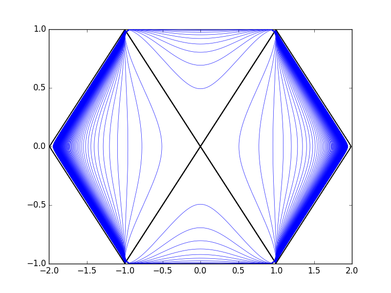
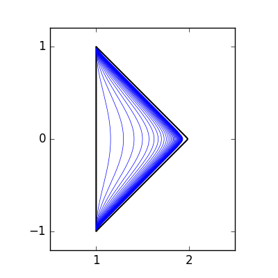
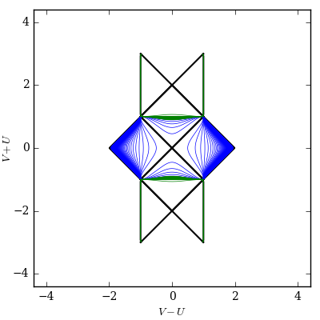
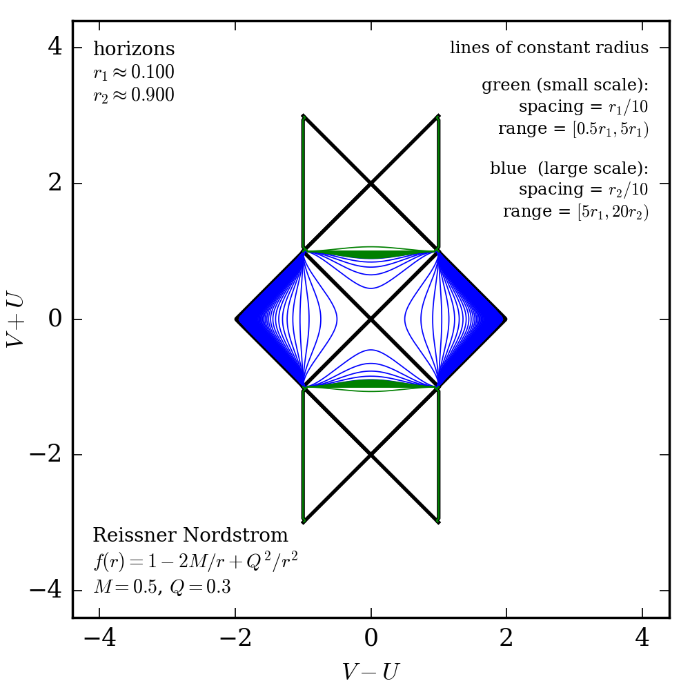

Getting Started: Minimal Examples
=================================

Basic syntax
############

The minimum syntax to generate a diagram with ``xhorizon`` is::
    
    import xhorizon as xh
    import matplotlib.pyplot as plt

    f = xh.mf.schwarzschild(R=1)
    reg = xh.reg.MAXreg(f)

    reg.rplot()
    plt.show()

Above you can think of:

* ``f`` as a "metric function" object, here (Schwarzschild) representing the function f(r)=1-R/r along with related integrals, roots, and other information.

* ``reg`` as a "region" object, as in "a maximally extended region with metric function f(r)", consisting of a collection of blocks, curves, and coordinate transformation functions.

By default the boundaries, horizons, and some constant radius lines are included, but the diagrams are completely customizeable. Later in the tutorial we will learn to turn off default features and add custom curves that can be defined in any of several standard coordinate systems. We will also see how to generate various types of regions and use built-in or custom metric functions to define the metric. But for now, back to the basics.

The output above was not very pretty. To make null rays at 45 degrees you must fix the aspect ratio. You can do this (and make a prettier plot) by adjusting matplotlib options in the usual ways::

    
    import xhorizon as xh
    import matplotlib.pyplot as plt

    f = xh.mf.minkowski()
    reg = xh.reg.MAXreg(f)

    plt.figure(1, figsize=(4,4))
    plt.xlim(.5,2.5)
    plt.ylim(-1.2,1.2)
    plt.xticks([1,2])
    plt.yticks([-1,0,1])
    plt.gca().set_aspect(1)

    reg.rplot()
    plt.savefig("out.png")

To make this easier you can use ``xh.newfig()`` to automatically "prettify" matplotlib settings and set aspect ratio::

    
    import xhorizon as xh
    import matplotlib.pyplot as plt

    f = xh.mf.reissner_nordstrom(M=0.5, Q=0.3)
    reg = xh.reg.MAXreg(f)

    xh.newfig()

    reg.rplot()
    plt.savefig("out.png", dpi = 200)

In this Reissner-Nordstrom example, the blue and green default lines are lines of constant radius at two different length scales, corresponding to the scales of the outer and inner horizons.

To make the diagram more useful we can add some informational annotations. The region and metric objects are capable of reporting some information about themselves::

    import xhorizon as xh
    import matplotlib.pyplot as plt

    f = xh.mf.reissner_nordstrom(M=0.5, Q=0.3)
    reg = xh.reg.MAXreg(f)

    xh.newfig()

    metric_info  = "\n".join([f.info[key] for key in ["Type", "Metric Function", "Parameters"]])
    horizon_info = "\n".join(["horizons", r"$r_1 \approx %.3f$"%(f.rj[1]),r"$r_2 \approx %.3f$"%(f.rj[2])])
    rlines_info  = "lines of constant radius\n\n"
    rlines_info += "\n".join(["green (small scale):", r"spacing = $r_1/10$", r"range = $[0.5r_1, 5r_1)$", "\n"])
    rlines_info += "\n".join(["blue  (large scale):", r"spacing = $r_2/10$", r"range = $[5r_1, 20r_2)$"])

    plt.annotate(text=metric_info,  xy=(-4.1,-4.1), ha='left',  va='bottom', size=8)
    plt.annotate(text=horizon_info, xy=(-4.1, 4.1), ha='left',  va='top',    size=8)
    plt.annotate(text=rlines_info,  xy=( 4.1, 4.1), ha='right', va='top',    size=7)

    reg.rplot()
    plt.savefig("out.png", dpi = 250)

