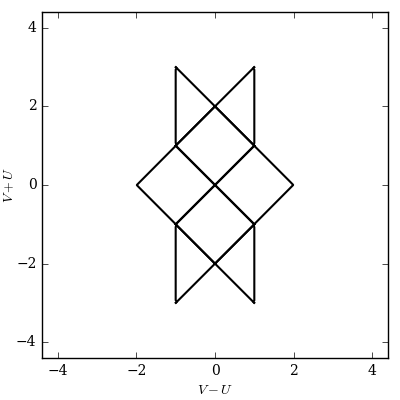
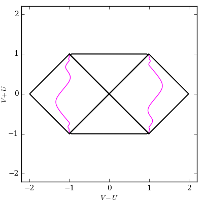
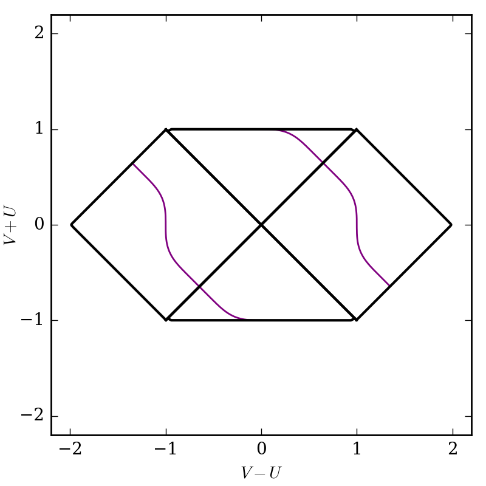
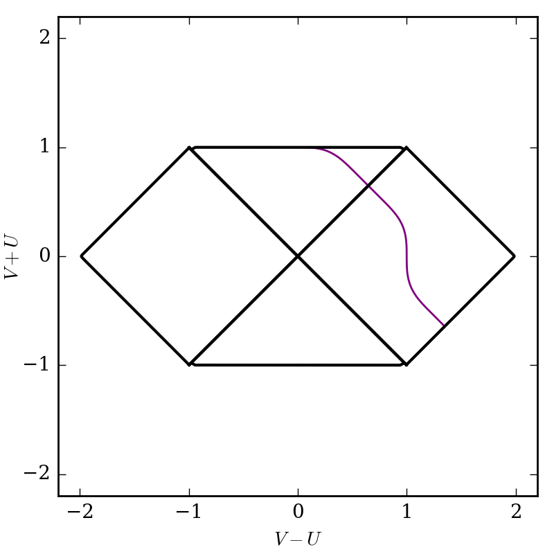
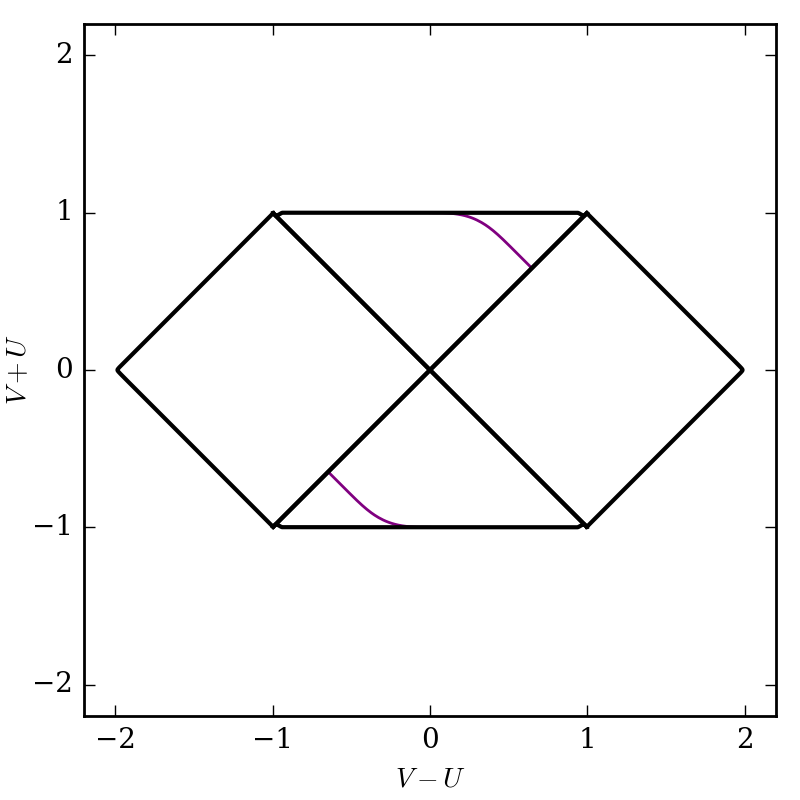
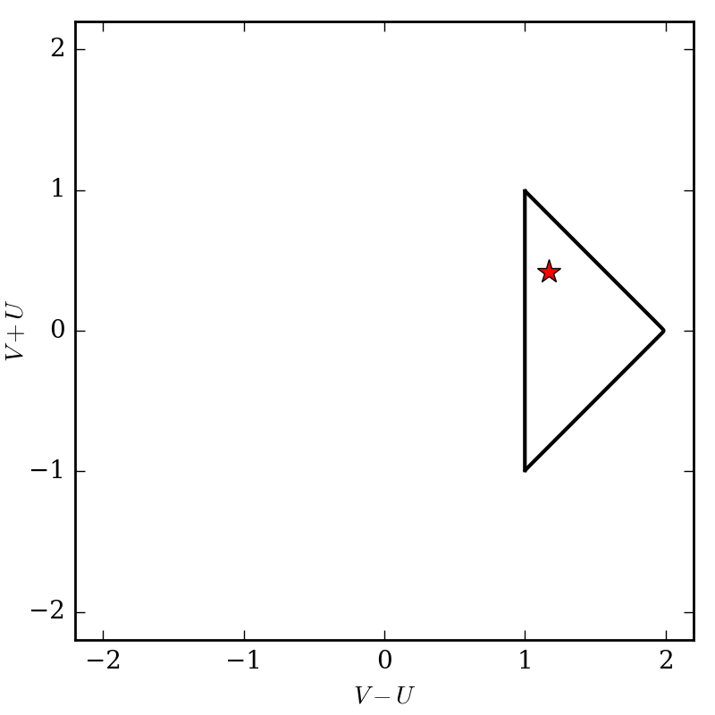

2. Adding arbitrary curves and removing default curves
======================================================

Adjusting defaults
##################

The region constructors provide default settings that can be modified by keyword argument. Try turning on/off the default boundary lines, lines of constant radius, and (u,v) coordinate (null Eddington-Finklestein) grid::

    import xhorizon as xh
    import matplotlib.pyplot as plt

    f = xh.mf.reissner_nordstrom(M=0.5, Q=0.3)

    reg = xh.reg.MAXreg(f, boundary=True, rlines=False, uvgrid=False)

    xh.newfig()
    reg.rplot()
    plt.savefig("out.png")

To start from a blank canvas set all three keywords ``False``. Then you can add whatever curves you like to the diagram.

Adding arbitrary curves manually
################################

As a test case let's add the rather arbitrary curve 

.. math::
    r=1.5 + 0.25 \, \sin(t), 

defined in Schwarzschild coordinates, into a Schwarzschild diagram::

    import xhorizon as xh
    import numpy as np
    import matplotlib.pyplot as plt

    f = xh.mf.schwarzschild(R=1)
    reg = xh.reg.MAXreg(f, boundary=True, rlines=False, uvgrid=False)

    t = np.linspace(-50,50,1001)
    r = 1.5 + 0.25*np.sin(t)

    crv = xh.curve()
    crv.tr = np.array([t,r])
    crv.sty = dict(c='magenta', lw=1, zorder=0)

    for b in reg.blocks:
        b.add_curves_tr([crv])

    xh.newfig(sqaxis=2)
    reg.rplot()
    plt.savefig("out.png")

The command ``xh.curve()`` created a "curve" object. A curve object represents the same curve in various coordinate systems. In this case we create the curve with Schwarzschild (t,r) coordinates only. Later, when ``b.add_curves_tr()`` is called, the region object automatically performs coordinate transformations to fill in other coordinate representations of the curve.

You will notice there are two copies of the curve.

This is because a ``region`` actually consists of a collection of ``blocks``. Each block has its own patch of Schwarzschild (t,r) and Eddington-Finklestein (u,v) coordinates. Blocks are separated by horizons (where :math:`f(r)=0`) and bounded by :math:`r=0` and :math:`r=\infty`. These boundaries are, of course, precisely where patches of Schwarzschild coordinates end.

With the loop ``for b in reg.blocks:`` we attempted to add the curve to every block in the region. However, the function ``block.add_curves_tr()`` rejects curves that include invalid radii for the block. In this case the curve lies entirely outside the horizon, and is successfully added to both "exterior" (:math:`r>R=2M`) blocks.

You can also add curves in :math:`(u,v)` coordinates with ``b.add_curves_uv()``, and add curves to specific blocks, both as shown below.

Note that the argument of ``block.add_curves_tr()`` is a list of curves. Here we only created one curve, so the argument was a length-one list ``[crv]``. More generally we can input a list of curve objects like ``[crv1,crv2]`` to add many curves at once. In the source this is often done by initiating a list ``crvlist = []`` and iterating through things of the form ``crvlist += [crv]`` to extend the list inside of a loop, then calling ``block.add_curves_tr(crvlist)``. The same goes for ``block.add_curves_uv()`` and related functions.

Add curves to specific blocks
#############################

Suppose we want to add a curve only to certain blocks. Let's consider the curve, defined in Eddington-Finklestein coordinates,

.. math::
    v = \tanh(u)

that is valid in any block. (Note it is timelike in the exterior and spacelike in the interior region.)

Adding to all blocks as before we have::

    import xhorizon as xh
    import numpy as np
    import matplotlib.pyplot as plt

    f = xh.mf.schwarzschild(R=1)
    reg = xh.reg.MAXreg(f, boundary=True, rlines=False, uvgrid=False)

    u = np.linspace(-50,50,1001)
    v = np.tanh(u)

    crv = xh.curve()
    crv.uv = np.array([u,v])
    crv.sty = dict(c='purple', lw=1, zorder=0)

    for b in reg.blocks:
        b.add_curves_uv([crv])

    xh.newfig(sqaxis=2)
    reg.rplot()
    plt.savefig("out.png", dpi=200)

To choose specific blocks to add the curve to, you can select them manually (find correct indices by guess and check)::

    import xhorizon as xh
    import numpy as np
    import matplotlib.pyplot as plt

    f = xh.mf.schwarzschild(R=1)
    reg = xh.reg.MAXreg(f, boundary=True, rlines=False, uvgrid=False)

    u = np.linspace(-50,50,1001)
    v = np.tanh(u)

    crv = xh.curve()
    crv.uv = np.array([u,v])
    crv.sty = dict(c='purple', lw=1, zorder=0)

    reg.blocks[0].add_curves_uv([crv])
    reg.blocks[1].add_curves_uv([crv])

    xh.newfig(sqaxis=2)
    reg.rplot()
    plt.savefig("out.png", dpi=200)

Alternately perhaps you only want to add curves to the "interior" or "exterior" blocks. Blocks contain an integer parameter ``block.j`` which describes which radius interval they are in. The case j=0 is the innermost block, bounded by :math:`r=0` and the innermost horizon radius. Each subsequent index moves radially outward. In the Schwarzschild case there is one horizon so the only options are j=0 and j=1. Here to plot only in interior blocks we could do::

    import xhorizon as xh
    import numpy as np
    import matplotlib.pyplot as plt

    f = xh.mf.schwarzschild(R=1)
    reg = xh.reg.MAXreg(f, boundary=True, rlines=False, uvgrid=False)

    u = np.linspace(-50,50,1001)
    v = np.tanh(u)

    crv = xh.curve()
    crv.uv = np.array([u,v])
    crv.sty = dict(c='purple', lw=1, zorder=0)

    for b in reg.blocks:
        if b.j==0:
            b.add_curves_uv([crv])

    xh.newfig(sqaxis=2)
    reg.rplot()
    plt.savefig("out.png", dpi=200)

Curve stylings
########################

Note that the style field ``curve.sty`` is a dictionary of parameters to be passed along to ``plt.plot()``, any of its keyword arguments should work. You can use this to specify linestyles, markers, widths, colors, etc. To plot specific points use a curve with just one point and set a marker::

    import xhorizon as xh
    import numpy as np
    import matplotlib.pyplot as plt

    f = xh.mf.minkowski()
    reg = xh.reg.MAXreg(f, boundary=True, rlines=False, uvgrid=True)

    t = np.array([1.75])
    r = np.array([0.91])

    crv = xh.curve()
    crv.tr = np.array([t,r])
    crv.sty = dict(c='red', marker='*', markersize=10, zorder=0)

    reg.blocks[0].add_curves_tr([crv])

    xh.newfig(sqaxis=2)
    reg.rplot()
    plt.savefig("out.png", dpi=200)

Using built-in curvemakers
##########################

...

